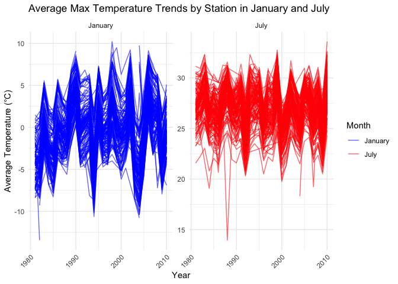
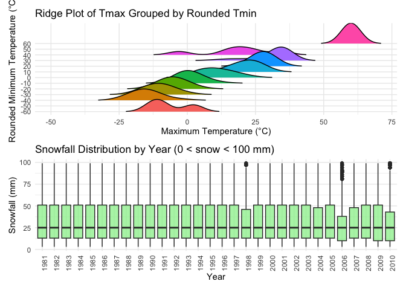

p8105_hw3_bt2654
================
Boxiang Tang
2024-10-11

## Problem 1

``` r
# Import & Load the data
library(p8105.datasets)
data("ny_noaa")
```

``` r
# Initial data explorations
library(tidyverse)
```

    ## ── Attaching core tidyverse packages ──────────────────────── tidyverse 2.0.0 ──
    ## ✔ dplyr     1.1.4     ✔ readr     2.1.5
    ## ✔ forcats   1.0.0     ✔ stringr   1.5.1
    ## ✔ ggplot2   3.5.1     ✔ tibble    3.2.1
    ## ✔ lubridate 1.9.3     ✔ tidyr     1.3.1
    ## ✔ purrr     1.0.2     
    ## ── Conflicts ────────────────────────────────────────── tidyverse_conflicts() ──
    ## ✖ dplyr::filter() masks stats::filter()
    ## ✖ dplyr::lag()    masks stats::lag()
    ## ℹ Use the conflicted package (<http://conflicted.r-lib.org/>) to force all conflicts to become errors

``` r
glimpse(ny_noaa)
```

    ## Rows: 2,595,176
    ## Columns: 7
    ## $ id   <chr> "US1NYAB0001", "US1NYAB0001", "US1NYAB0001", "US1NYAB0001", "US1N…
    ## $ date <date> 2007-11-01, 2007-11-02, 2007-11-03, 2007-11-04, 2007-11-05, 2007…
    ## $ prcp <int> NA, NA, NA, NA, NA, NA, NA, NA, NA, NA, NA, NA, NA, NA, NA, NA, 3…
    ## $ snow <int> NA, NA, NA, NA, NA, NA, NA, NA, NA, NA, NA, NA, NA, NA, NA, NA, 3…
    ## $ snwd <int> NA, NA, NA, NA, NA, NA, NA, NA, NA, NA, NA, NA, NA, NA, NA, NA, 0…
    ## $ tmax <chr> NA, NA, NA, NA, NA, NA, NA, NA, NA, NA, NA, NA, NA, NA, NA, NA, N…
    ## $ tmin <chr> NA, NA, NA, NA, NA, NA, NA, NA, NA, NA, NA, NA, NA, NA, NA, NA, N…

``` r
summary(ny_noaa)
```

    ##       id                 date                 prcp               snow       
    ##  Length:2595176     Min.   :1981-01-01   Min.   :    0.00   Min.   :  -13   
    ##  Class :character   1st Qu.:1988-11-29   1st Qu.:    0.00   1st Qu.:    0   
    ##  Mode  :character   Median :1997-01-21   Median :    0.00   Median :    0   
    ##                     Mean   :1997-01-01   Mean   :   29.82   Mean   :    5   
    ##                     3rd Qu.:2005-09-01   3rd Qu.:   23.00   3rd Qu.:    0   
    ##                     Max.   :2010-12-31   Max.   :22860.00   Max.   :10160   
    ##                                          NA's   :145838     NA's   :381221  
    ##       snwd            tmax               tmin          
    ##  Min.   :   0.0   Length:2595176     Length:2595176    
    ##  1st Qu.:   0.0   Class :character   Class :character  
    ##  Median :   0.0   Mode  :character   Mode  :character  
    ##  Mean   :  37.3                                        
    ##  3rd Qu.:   0.0                                        
    ##  Max.   :9195.0                                        
    ##  NA's   :591786

``` r
# Convert tmax and tmin to numeric
ny_noaa$tmax <- as.numeric(ny_noaa$tmax)
ny_noaa$tmin <- as.numeric(ny_noaa$tmin)

# Check for any conversion issues
summary(ny_noaa$tmax)
```

    ##    Min. 1st Qu.  Median    Mean 3rd Qu.    Max.    NA's 
    ##  -389.0    50.0   150.0   139.8   233.0   600.0 1134358

``` r
summary(ny_noaa$tmin)
```

    ##    Min. 1st Qu.  Median    Mean 3rd Qu.    Max.    NA's 
    ##  -594.0   -39.0    33.0    30.3   111.0   600.0 1134420

### Description of Raw Data:

The dataset contains 2595176 observations and 7 variables. Below are the
key details:

- **Key Variables:**

  - date (character): Dates range from 1981-01-01 to 2010-12-31,
    spanning 1.0956^{4} days.

  - prcp (numeric): Precipitation (tenths of mm), ranging from 0 to
    22860 with an average of 29.8232355.

  - snow (numeric): Snowfall amount (mm), with an average of 4.987025
    and a maximum of 10160.

  - snwd (numeric): Snow depth (mm), ranging from 0 to 9195.

  - tmax (character -\> numeric): Maximum temperature (tenths of degrees
    Celsius), averaging 139.7983842 degrees Celsius.

  - tmin (character -\> numeric): Minimum temperature (tenths of degrees
    Celsius), with an average of 30.2853741 degrees Celsius.

``` r
# Analyzing missing values of the raw data

missing_data_summary = 
  ny_noaa |>
  summarise(across(everything(), 
                   ~ sum(is.na(.))))


missing_data_percentage = 
  missing_data_summary / nrow(ny_noaa) * 100

missing_data_summary
```

<div data-pagedtable="false">

<script data-pagedtable-source type="application/json">
{"columns":[{"label":["id"],"name":[1],"type":["int"],"align":["right"]},{"label":["date"],"name":[2],"type":["int"],"align":["right"]},{"label":["prcp"],"name":[3],"type":["int"],"align":["right"]},{"label":["snow"],"name":[4],"type":["int"],"align":["right"]},{"label":["snwd"],"name":[5],"type":["int"],"align":["right"]},{"label":["tmax"],"name":[6],"type":["int"],"align":["right"]},{"label":["tmin"],"name":[7],"type":["int"],"align":["right"]}],"data":[{"1":"0","2":"0","3":"145838","4":"381221","5":"591786","6":"1134358","7":"1134420"}],"options":{"columns":{"min":{},"max":[10]},"rows":{"min":[10],"max":[10]},"pages":{}}}
  </script>

</div>

``` r
missing_data_percentage
```

<div data-pagedtable="false">

<script data-pagedtable-source type="application/json">
{"columns":[{"label":["id"],"name":[1],"type":["dbl"],"align":["right"]},{"label":["date"],"name":[2],"type":["dbl"],"align":["right"]},{"label":["prcp"],"name":[3],"type":["dbl"],"align":["right"]},{"label":["snow"],"name":[4],"type":["dbl"],"align":["right"]},{"label":["snwd"],"name":[5],"type":["dbl"],"align":["right"]},{"label":["tmax"],"name":[6],"type":["dbl"],"align":["right"]},{"label":["tmin"],"name":[7],"type":["dbl"],"align":["right"]}],"data":[{"1":"0","2":"0","3":"5.61958","4":"14.6896","5":"22.80331","6":"43.71025","7":"43.71264"}],"options":{"columns":{"min":{},"max":[10]},"rows":{"min":[10],"max":[10]},"pages":{}}}
  </script>

</div>

### Data about the missing values for the key variables:

- prcp: 145838 missing values (5.62% of the total dataset)

- snow: 381221 missing values (14.69%)

- snwd: 591786 missing values (22.8%)

- tmax: 1134358 missing values (43.71%)

- tmin: 1134420 missing values (43.71%)

### Indication of Missing Data Extent:

- The missing data percentage ranges significantly across variables.
  prcp has the least amount of missing data (5.62%), which is relatively
  low and unlikely to affect overall precipitation analysis
  significantly. However, imputation or removing these rows could be
  considered depending on the specific analysis.

- For snow, the missing data is approximately 14.69%, which is more
  substantial. Missing snowfall data could limit the ability to analyze
  snowfall patterns accurately, particularly for locations or periods
  where snow might be expected. snwd has about 22.8% missing data. This
  level indicates that snow depth information might be inconsistent, and
  analyses relying on snow accumulation may be biased or less reliable
  without appropriate imputation methods.

- The most critical concern is with tmax and tmin, both of which have
  approximately 43.71% missing values. Such a high percentage implies
  that temperature data is nearly absent for almost half of the dataset.
  This poses a major limitation for any temperature-related analysis,
  such as identifying seasonal trends or calculating average
  temperatures. Given this extent of missing data, imputation techniques
  (like interpolation based on nearby stations) or focusing analyses on
  stations with more complete data might be necessary. In some cases,
  entire segments of the dataset might need to be excluded if
  temperature analysis is central to the study.

- Summary: The extent of missing data varies, with some variables (like
  prcp) showing manageable levels of missingness, while others
  (especially tmax and tmin) present significant issues. For temperature
  data, the missing rate of nearly 44% indicates a serious data quality
  issue, requiring careful handling to avoid biased or incomplete
  analysis outcomes

``` r
# Data cleaning methods

# 1. Convert the date column to Date type and extract year, month, and day
ny_noaa =
  ny_noaa |>
  mutate(
    date = as.Date(date),
    year = as.integer(format(date, "%Y")),
    month = as.integer(format(date, "%m")),
    day = as.integer(format(date, "%d"))
  )


# 2. Convert temperature and precipitation to proper units
ny_noaa =
  ny_noaa |>
  mutate(
    prcp = prcp / 10,  # Convert precipitation to mm
    tmax = as.numeric(tmax) / 10,  # Convert to degrees Celsius
    tmin = as.numeric(tmin) / 10   # Convert to degrees Celsius
  )

# 3. Identify most commonly observed snowfall values
snowfall_distribution = 
  ny_noaa |>
  filter(!is.na(snow)) |>
  count(snow, sort = TRUE)

head(snowfall_distribution, 5)
```

<div data-pagedtable="false">

<script data-pagedtable-source type="application/json">
{"columns":[{"label":["snow"],"name":[1],"type":["int"],"align":["right"]},{"label":["n"],"name":[2],"type":["int"],"align":["right"]}],"data":[{"1":"0","2":"2008508"},{"1":"25","2":"31022"},{"1":"13","2":"23095"},{"1":"51","2":"18274"},{"1":"76","2":"10173"}],"options":{"columns":{"min":{},"max":[10]},"rows":{"min":[10],"max":[10]},"pages":{}}}
  </script>

</div>

### Important information from the manipulated data:

- Average precipitation: 2.9823236 mm, with a standard deviation of
  7.8180254.

- Average maximum temperature (tmax): 13.9798384 °C.

- Average minimum temperature (tmin): 3.0285374 °C.

- The most frequently recorded snowfall value is 0 mm, which occurs
  2008508 times, indicating no snowfall on most recorded days. The
  possible reasons for that could be following:

  - **Nature of the Dataset (GHCN-Daily):** The Global Historical
    Climatology Network-Daily (GHCN-Daily) database is structured to
    record daily weather statistics. In climates like New York’s, it is
    expected that a large proportion of daily observations would have no
    snowfall, as even in winter months, many days do not receive
    measurable snow. Thus, the design and recording frequency of the
    dataset contribute to a higher frequency of zero values.

  - **Seasonality and Climate of New York State:** New York experiences
    distinct seasonal changes. Snowfall typically occurs during the
    winter months (December through February), with possible snowfall
    events extending into late autumn (November) and early spring
    (March). For the remainder of the year (approximately 7-8 months),
    snowfall is uncommon or non-existent. As a result, for these
    non-winter months, the recorded snowfall value is naturally 0 mm,
    significantly increasing the frequency of zero values.

  - **Incomplete or Selective Data Reporting:** As noted in the
    dataset’s description, each station may collect only a subset of the
    variables, which could mean that not all stations consistently
    report snowfall data, especially if snowfall is infrequent in those
    regions. This selective reporting could bias the dataset toward more
    frequent 0 mm values, as stations that rarely or never observe snow
    may default to reporting zero.

``` r
# Make two-panel plot showing the average max temperature in January & July in each station across years

# Load necessary libraries
library(ggplot2)
library(dplyr)
library(patchwork)


# Calculate the average max temperatures for January and July for each station
avg_tmax_jan_jul_station = 
  ny_noaa |>
  filter(month %in% c(1, 7)) |>
  group_by(id, year, month) |>
  summarise(avg_tmax = mean(tmax, na.rm = TRUE)) |>
  ungroup()
```

    ## `summarise()` has grouped output by 'id', 'year'. You can override using the
    ## `.groups` argument.

``` r
# Create a faceted line plot by station for January and July
facet_line_plot = 
  ggplot(avg_tmax_jan_jul_station, 
         aes(x = year, y = avg_tmax, 
             group = id, 
             color = factor(month))) +
  geom_line(alpha = 0.6) +
  scale_color_manual(values = c("blue", "red"), 
                     labels = c("January", "July")) +
  labs(title = "Average Max Temperature Trends by Station in January and July",
       x = "Year", 
       y = "Average Temperature (°C)", 
       color = "Month") +
  facet_wrap(~ month, 
             scales = "free_y", 
             labeller = labeller(month = c('1' = "January", 
                                           '7' = "July"))) +
  theme_minimal() +
  theme(axis.text.x = element_text(angle = 45, 
                                   hjust = 1))

facet_line_plot
```

<!-- -->

### Analysis of the Two-Panel Graph

**January Panel：** The January panel reveals that average maximum
temperatures across stations remain relatively stable over time, with
most stations showing consistent patterns without a long-term upward or
downward trend. This stability indicates that winter temperatures have
not experienced significant shifts in the observed years. However, some
stations exhibit occasional deviations where temperatures either spike
higher or dip lower than the rest, signaling potential outliers. These
outliers could be due to isolated cold or warm events or data anomalies
specific to certain stations.

**July Panel：** In contrast, the July panel displays a broader range of
temperatures, with most stations fluctuating between 25 and 30°C. A
slight upward trend is visible across several stations, hinting at a
gradual warming pattern consistent with summer climate change impacts.
Unlike January, there is more pronounced variability in July
temperatures, with some stations showing extreme values either above
30°C or below 20°C. These variations may correspond to heatwaves or
localized microclimatic effects, presenting potential outliers that
require further investigation.

**Summary Comparison：** The January and July panels demonstrate
distinct seasonal patterns. January temperatures remain stable with
minimal long-term change, suggesting resilience in winter conditions,
while July temperatures show more variability and a slight warming trend
over time. The July panel also highlights a higher frequency of
outliers, indicative of the greater susceptibility of summer
temperatures to extreme events and localized climatic influences. This
contrast emphasizes that summer months are more sensitive to temperature
fluctuations and potential climate change effects than winter months.

``` r
# Make two-panel plot showing tmax vs tmin for the full dataset & the distribution of snowfall values greater than 0 and less than 100 

# Load necessary libraries
library(ggplot2)
library(dplyr)
library(ggridges)

# Prepare data for tmax vs tmin ridge plot
tmax_tmin_data <- ny_noaa %>%
  filter(!is.na(tmax) & !is.na(tmin))

# Create a ridge plot for tmax grouped by rounded tmin values
tmax_tmin_ridge_plot <- ggplot(tmax_tmin_data, aes(x = tmax, y = factor(round(tmin, -1)), fill = factor(round(tmin, -1)))) +
  geom_density_ridges(scale = 3, rel_min_height = 0.01) +
  labs(title = "Ridge Plot of Tmax Grouped by Rounded Tmin",
       x = "Maximum Temperature (°C)",
       y = "Rounded Minimum Temperature (°C)") +
  theme_minimal() +
  theme(legend.position = "none")

# Prepare data for the snowfall distribution plot
snowfall_data <- ny_noaa %>%
  filter(snow > 0 & snow < 100) %>%
  group_by(year) %>%
  mutate(year = as.factor(year))

# Create a boxplot showing the distribution of snowfall values per year
snowfall_boxplot <- ggplot(snowfall_data, aes(x = year, y = snow)) +
  geom_boxplot(fill = "lightgreen", alpha = 0.7) +
  labs(title = "Snowfall Distribution by Year (0 < snow < 100 mm)",
       x = "Year", y = "Snowfall (mm)") +
  theme_minimal() +
  theme(axis.text.x = element_text(angle = 90, hjust = 1))

# Combine the plots into a two-panel layout
combined_plot <- tmax_tmin_ridge_plot / snowfall_boxplot
combined_plot
```

    ## Picking joint bandwidth of 3.63

<!-- -->

### Analysis of the Two-Panel Graph

**Panel 1: Ridge Plot of tmax Grouped by Rounded tmin** The ridge plot
illustrates the distribution of tmax values across different tmin
categories. As tmin values increase, the distributions of tmax shift
towards higher values, demonstrating a clear positive correlation
between the two variables. The spread of the ridges indicates that
maximum temperatures are more variable when minimum temperatures are
low, but they become narrower and more consistent as tmin increases. The
peaks in the ridges show the most common tmax values for each tmin
category, confirming that higher minimum temperatures typically lead to
higher and more stable maximum temperatures.

**Panel 2: Boxplot of Snowfall Distribution by Year** The boxplot shows
the annual distribution of snowfall values between 0 and 100 mm,
revealing the variability and consistency of snowfall over the years.
While the median snowfall value remains generally stable, the
interquartile ranges (IQR) vary, indicating differences in consistency
from year to year. The presence of outliers highlights years with
extreme snowfall events that deviate significantly from the norm,
suggesting occasional severe weather occurrences that influence snowfall
patterns.

**Summary** The ridge plot shows a consistent relationship between tmin
and tmax, with temperatures becoming more stable as tmin rises. In
contrast, the snowfall boxplot reveals annual variability, with stable
medians but varying ranges and outliers indicating extreme events.
Together, these panels effectively highlight the stability in
temperature patterns and the variability in snowfall over time.

## Problem 2
